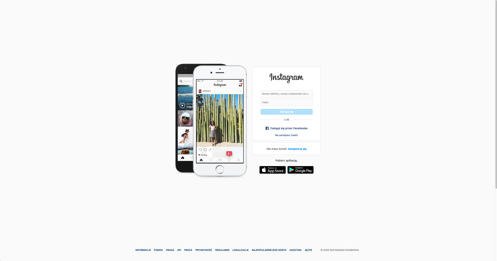

# Zadanie domowe 1

This is a homework activity that I completed while taking the first module on a Front-end Developer course at InfoShare Academy. It consisted of two parts:

## Part 1 - Creating an Image Gallery with CSS Grid

[Link to my grid](https://malgorzata-niemczyk.github.io/jfdzr2-homework-1/grid/index.html)

## Part 2 - recreating the Layout of an Instagram Login Page

[Link to recreated Instagram](https://malgorzata-niemczyk.github.io/jfdzr2-homework-1/instagram/index.html)
